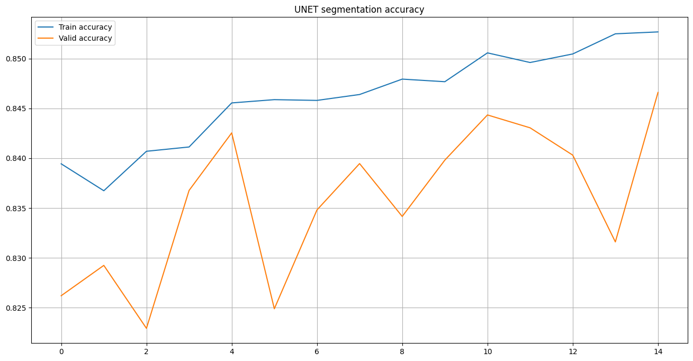
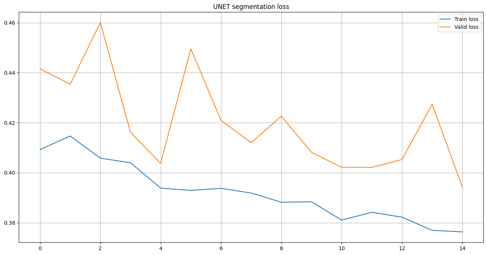
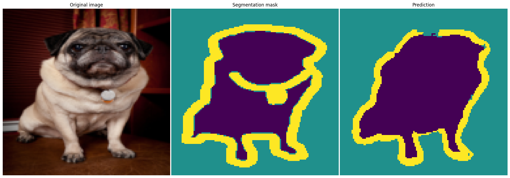
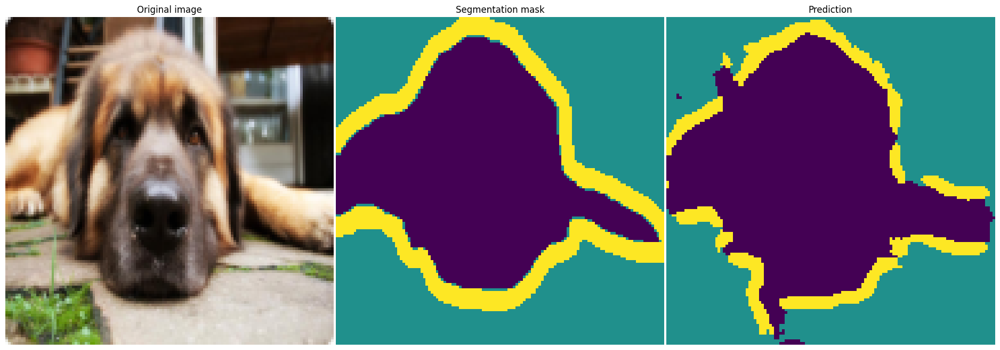

# UNet for Oxford-IIIT Pet Dataset Segmentation

Этот репозиторий содержит реализацию нейронной сети архитектуры UNet для задачи семантической сегментации на датасете Oxford-IIIT Pet Dataset. Проект включает в себя предварительный анализ данных, подготовку функций для обучения, реализацию модели UNet и процесс обучения с визуализацией результатов.

## Описание проекта

### Датасет
Используется датасет [Oxford-IIIT Pet Dataset](https://www.robots.ox.ac.uk/~vgg/data/pets/), который содержит изображения домашних животных и соответствующие маски сегментации. Датасет включает 37 категорий животных, каждая из которых имеет около 200 изображений.

### Архитектура модели
Модель UNet используется для задачи семантической сегментации. UNet состоит из энкодера и декодера, соединенных skip-connections, что позволяет сохранять пространственную информацию и улучшать качество сегментации.

### Основные этапы проекта
1. **Анализ данных**: Исследование датасета, визуализация изображений и масок.
2. **Подготовка данных и функций**: Написание функций для обучения, инференса и визуализации, предобработка данных.
3. **Реализация модели**: Создание архитектуры UNet.
4. **Обучение модели**: Настройка и запуск процесса обучения.
5. **Визуализация результатов**: Анализ качества модели через визуализацию предсказаний.

## Структура репозитория
| Файл/Папка          | Описание                             |
|---------------------|-------------------------------------|
| `segmentation-neural-net.ipynb`    | Основной ноутбук проекта             |
| `images/`           | Папка с изображениями для примеров   |
| `README.md`         | Документация проекта                 |

## Результаты

### График точности свёрточной нейронной сети архитектуры UNet:

### График потерь свёрточной нейронной сети архитектуры UNet:

## Примеры визуализации предсказаний:

### Пример №1:

### Пример №2:

## Дополнительные материалы

- **Документация PyTorch** — Официальная документация PyTorch, включающая описание работы с моделями, оптимизаторами, загрузчиками данных и многим другим. [Ссылка](https://pytorch.org/docs/stable/index.html)
- **Документация torchvision.datasets** — Руководство по загрузке и работе с датасетами, включая Oxford-IIIT Pet Dataset. [Ссылка](https://pytorch.org/vision/stable/datasets.html)
- **Руководство по созданию UNet на PyTorch** — Пошаговое руководство по реализации архитектуры UNet для задач семантической сегментации. [Ссылка](https://pytorch.org/hub/mateuszbuda_brain-segmentation-pytorch_unet/)
- **Визуализация данных в Matplotlib** — Официальное руководство по использованию библиотеки Matplotlib для визуализации данных, включая изображения и маски. [Ссылка](https://matplotlib.org/stable/contents.html)
- **Руководство по семантической сегментации** — Обзор методов и подходов к семантической сегментации, включая использование UNet. [Ссылка](https://towardsdatascience.com/understanding-semantic-segmentation-with-unet-6be4f42d4b47)
- **Oxford-IIIT Pet Dataset** — Официальная страница датасета с описанием и ссылками для скачивания. [Ссылка](https://www.robots.ox.ac.uk/~vgg/data/pets/)